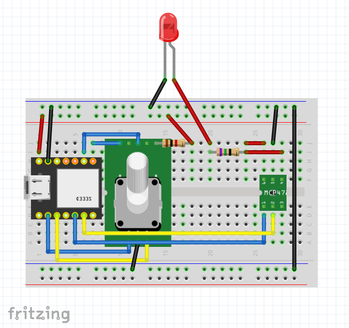
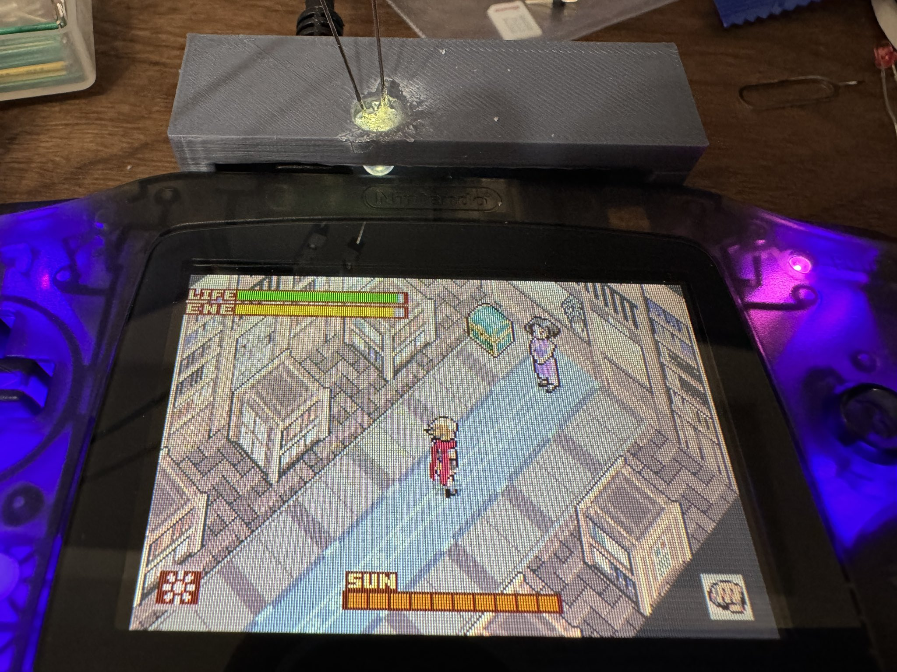
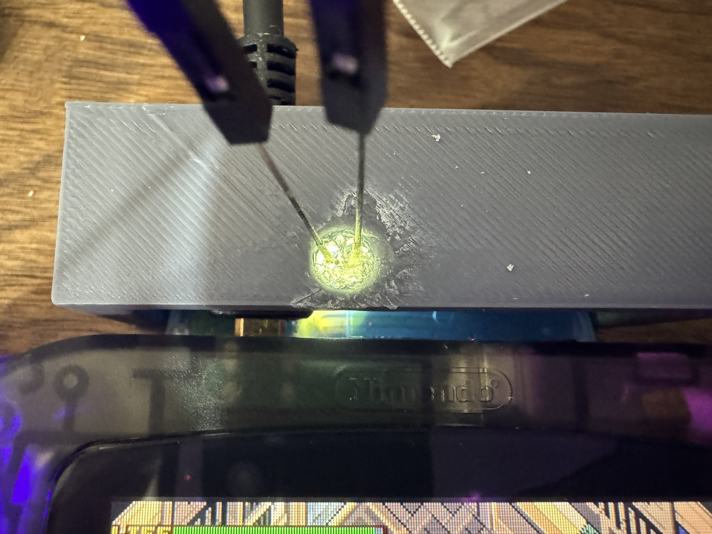

# boktai_led
## WARNING
This program/hardware is using ultraviolet LED.

**DO NOT look at the LED directly.**

## Description
A TinyGo program to control the ultraviolet LED with DAC and control the solar sensor on the Boktai series GBA cartridge.

# Hardware
## Parts
- [Seeeduino XIAO RP2040](https://wiki.seeedstudio.com/XIAO-RP2040/)
- [MCP4726](https://www.microchip.com/en-us/product/mcp4726)
  - Available on [秋月電子通商](https://akizukidenshi.com/), code: `K-07995`
- Ultraviolet LED
  - 375nm wavelength is recommended.
  - 5mm diameter is recommended.
  - Available on [秋月電子通商](https://akizukidenshi.com/), code: `I-13023`
- Rotary Encoder
  - We use RGB LED Rotary Encoder, but it is not necessary.
  - Available on [秋月電子通商](https://akizukidenshi.com/), code: `P-05773`
- 75Ω Resistor
  - For LED current limit.
  - We use 5V amd 20mA LED, so 75Ω is recommended.
  - Check and calculate the resistor value with [LEDの抵抗値計算](https://akizukidenshi.com/catalog/contents1/led-r-calc.aspx)
- 1kΩ Resistor
  - For Rotary Encoder push button and LED current limit.

## Circuit
### Connection
- Connect XIAO RP2040 and MCP4726 with I2C.
  - XIAO RP2040 PIN: https://wiki.seeedstudio.com/XIAO-RP2040/#hardware-overview
  - XIAO RP2040 SDA(D4) -> MCP4726 SDA
  - XIAO RP2040 SCL(D5) -> MCP4726 SCL
  - 5V -> MCP4726 VDD
  - GND -> MCP4726 VSS
- Connect MCP4726 VOUT to LED with 75Ω resistor.
- Connect XIAO RP2040 and RGB LED Rotary Encoder.
  - XIAO RP2040 D1 -> Rotary Encoder A
  - XIAO RP2040 D2 -> Rotary Encoder B
  - GND -> Rotary Encoder C
  - XIAO RP2040 D7 -> Rotary Encoder LED R or G or B(choose one you like)
  - XIAO RP2040 D8 -> Rotary Encoder SW
  - 5V -> Rotary Encoder VCC with 1kΩ resistor

### Sample circuit diagram


# 3D Printing Case
Print with 3D printer.
- [boktai_solar.stl](./boktai_solar.stl)

This case is for holding UV LED.

You can also connect HDMI cable to GBA if you customized GBA for HDMI output.

We fixed the LED with glue for strong UV light.
Please find the best LED degree for your GBA and fix it!




# Software
## Compile and flash
```sh
tinygo flash -target xiao-rp2040 .
```

# How to use
1. Compile and flash the program to XIAO RP2040.
2. Connect XIAO RP2040 to PC or something power source.
3. Turn clockwise the Rotary Encoder to increase the LED brightness.
4. Turn counterclockwise the Rotary Encoder to decrease the LED brightness.
5. Push the Rotary Encoder to turn on/off the LED.
6. HAVE FUN!

# References
- [Seeed XIAO RP2040 | TinyGo](https://tinygo.org/docs/reference/microcontrollers/xiao-rp2040/)
- [DAコンバータの使い方 [Arduino]](https://www.petitmonte.com/robot/howto_da_converter.html)
